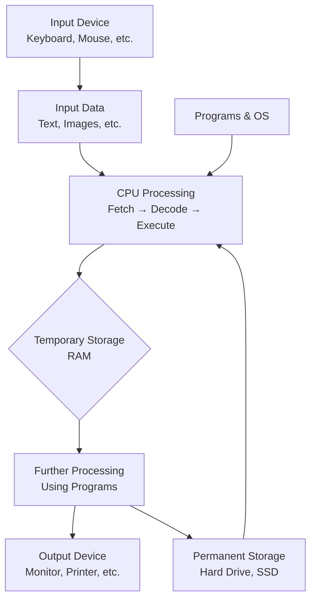

# 01. What is a Computer?

## Introduction

Welcome to the very beginning of your programming journey! Before we dive into writing code, it's essential to understand what a computer is. Computers are the tools we use to run programs, and programming is all about telling computers what to do. This chapter will explain computers in simple terms, from the basics to how they work, including everything that school children learn about computers.

## What is a Computer?

A **computer** is an electronic device that can store, retrieve, and process data. It follows instructions (called programs) to perform tasks like calculating numbers, displaying images, or playing music. Think of a computer as a super-smart assistant that can do many things quickly and accurately.

Computers are machines that help us in many ways:
- They can solve math problems very fast
- They can store lots of information
- They can show pictures and videos
- They can play games and music
- They can help us write stories and draw pictures
- They can connect us with friends and family around the world

### Key Characteristics of Computers:
- **Speed**: Computers can perform millions of operations per second.
- **Accuracy**: They make very few mistakes if programmed correctly.
- **Storage**: They can store huge amounts of information.
- **Versatility**: They can be used for many different tasks.
- **Diligence**: They can work for long hours without getting tired.
- **Automation**: They can perform tasks repeatedly without boredom.

## History and Evolution of Computers

### The Abacus (2400 BC)
The first calculating device was the abacus, used by ancient civilizations for counting and calculations.

### Mechanical Calculators (17th-19th Century)
- **Pascal's Calculator (1642)**: Could add and subtract
- **Leibniz's Calculator (1673)**: Could multiply and divide
- **Difference Engine (1822)**: Designed by Charles Babbage for calculating mathematical tables

### First Generation Computers (1940s-1950s)
- Used vacuum tubes
- Very large and expensive
- Generated a lot of heat
- Examples: ENIAC, UNIVAC

### Second Generation Computers (1950s-1960s)
- Used transistors instead of vacuum tubes
- Smaller, faster, and more reliable
- Used magnetic core memory
- Examples: IBM 1401, CDC 1604

### Third Generation Computers (1960s-1970s)
- Used integrated circuits
- Even smaller and more powerful
- Introduced operating systems
- Examples: IBM System/360, PDP-8

### Fourth Generation Computers (1970s-Present)
- Used microprocessors
- Very small, powerful, and affordable
- Personal computers became common
- Examples: Apple II, IBM PC, modern computers

### Fifth Generation Computers (Present-Future)
- Artificial Intelligence and parallel processing
- Quantum computers
- Neural networks and expert systems

## Generations of Computers - Detailed

| Generation | Period | Technology | Size | Speed | Examples |
|------------|--------|------------|------|-------|----------|
| 1st | 1940-1956 | Vacuum Tubes | Room-sized | Slow | ENIAC, UNIVAC |
| 2nd | 1956-1963 | Transistors | Smaller | Faster | IBM 1401 |
| 3rd | 1964-1971 | ICs | Even smaller | Much faster | IBM 360 |
| 4th | 1971-Present | Microprocessors | Very small | Very fast | PCs, laptops |
| 5th | Present-Future | AI, Quantum | Various | Super fast | Quantum computers |

## Parts of a Computer - Detailed

Computers have two main parts: **hardware** and **software**. Let's break them down in detail.

### Hardware - The Physical Parts

Hardware is the physical parts of the computer that you can touch. It's like the body's organs.

#### 1. Central Processing Unit (CPU)
- **Also called**: Processor, Microprocessor
- **Function**: The "brain" of the computer. It processes instructions and performs calculations.
- **Parts**: Control Unit, Arithmetic Logic Unit (ALU), Registers
- **Speed measured in**: GHz (Gigahertz)
- **Examples**: Intel Core i7, AMD Ryzen

#### 2. Memory (RAM - Random Access Memory)
- **Function**: Temporary storage for data the computer is currently using. It's like short-term memory.
- **Types**: DDR4, DDR5
- **Capacity**: Measured in GB (Gigabytes)
- **Speed**: Very fast, but loses data when power is off
- **Purpose**: Holds programs and data being used right now

#### 3. Storage Devices - Long-term Memory
- **Hard Disk Drive (HDD)**: Uses spinning disks, slower but cheaper
- **Solid State Drive (SSD)**: Uses flash memory, faster but more expensive
- **Capacity**: Measured in GB or TB (Terabytes)
- **Purpose**: Stores data permanently even when computer is off

#### 4. Input Devices
Devices that let you give information to the computer:
- **Keyboard**: For typing text and commands
- **Mouse**: For pointing and clicking
- **Scanner**: For converting paper documents to digital
- **Microphone**: For recording sound
- **Webcam**: For capturing video
- **Touchscreen**: For direct interaction
- **Joystick/Gamepad**: For gaming
- **Digital Camera**: For taking pictures

#### 5. Output Devices
Devices that show or produce the results:
- **Monitor/Screen**: Displays visual information
- **Printer**: Produces hard copies of documents
- **Speakers**: Produce sound
- **Headphones**: Personal audio output
- **Projector**: Displays images on large screens

#### 6. Motherboard
- **Function**: The main circuit board that connects all hardware components
- **Components**: CPU socket, RAM slots, expansion slots, power connectors
- **Also called**: Mainboard, System board

#### 7. Power Supply Unit (PSU)
- **Function**: Converts AC power to DC power for computer components
- **Measured in**: Watts (e.g., 500W, 750W)

#### 8. Expansion Cards
- **Graphics Card (GPU)**: Handles video processing and gaming
- **Sound Card**: Processes audio
- **Network Card**: Enables internet connection
- **TV Tuner Card**: Receives TV signals

#### 9. Ports and Connectors
- **USB Ports**: For connecting external devices
- **HDMI/DisplayPort**: For connecting monitors
- **Ethernet Port**: For wired internet
- **Audio Jacks**: For speakers and microphones

### Software - The Programs

Software is the programs and instructions that tell the hardware what to do. It's like the mind controlling the body.

#### 1. Operating System (OS)
The main software that manages the computer:
- **Windows**: Made by Microsoft, most common
- **macOS**: Made by Apple, for Mac computers
- **Linux**: Free and open-source, very powerful
- **Android**: For mobile devices
- **iOS**: For iPhones and iPads

**Functions of OS**:
- Manages hardware resources
- Provides user interface
- Runs applications
- Manages files and folders
- Provides security

#### 2. System Software
- **Device Drivers**: Help OS communicate with hardware
- **Utilities**: Tools for maintenance (antivirus, disk cleanup)
- **Firmware**: Software built into hardware devices

#### 3. Application Software
Programs for specific tasks:
- **Word Processors**: Microsoft Word, Google Docs
- **Spreadsheets**: Microsoft Excel, Google Sheets
- **Web Browsers**: Chrome, Firefox, Safari
- **Media Players**: VLC, Windows Media Player
- **Games**: Various entertainment software
- **Educational Software**: Learning programs

#### 4. Programming Software
- **Compilers**: Translate programming languages
- **Interpreters**: Execute code directly
- **Integrated Development Environments (IDEs)**: Code editors with tools
- **Debuggers**: Help find and fix errors

## How Does a Computer Work? - Detailed IPO Cycle

Computers work by following a simple but powerful cycle called the IPO Cycle (Input-Process-Output). Let's understand each step in detail:

### 1. Input
- **What happens**: You provide data to the computer
- **How**: Using input devices like keyboard, mouse, scanner
- **Examples**:
  - Typing a letter on keyboard
  - Clicking a mouse button
  - Scanning a photo
  - Recording audio with microphone
- **Data types**: Text, numbers, images, sounds, videos

### 2. Processing
- **What happens**: The CPU processes the data using instructions from programs
- **How it works**:
  - CPU fetches instructions from memory
  - Decodes what the instruction means
  - Executes the instruction
  - Stores results back in memory
- **Binary System**: Computers use only 0s and 1s (binary digits or bits)
- **Machine Language**: The only language computers understand directly

### 3. Output
- **What happens**: Computer shows or produces the results
- **How**: Using output devices
- **Examples**:
  - Displaying text on screen
  - Printing documents
  - Playing sounds through speakers
  - Showing videos

### 4. Storage
- **What happens**: Data can be saved for later use
- **Types**:
  - **Primary Storage**: RAM (temporary)
  - **Secondary Storage**: Hard drives, SSDs (permanent)
- **File Systems**: Ways to organize stored data (folders, files)

### Extended IPO Cycle

The basic cycle can be extended to include more steps:

1. **Input** → 2. **Processing** → 3. **Storage** → 4. **Processing** → 5. **Output**
6. **Storage** (for saving results)

### Diagram: Detailed Computer IPO Cycle

## Binary System and Digital Logic

### Binary Numbers
- Computers use binary (base 2) instead of decimal (base 10)
- Only two digits: 0 and 1
- Each digit is called a **bit**
- 8 bits = 1 **byte**
- 1024 bytes = 1 **kilobyte** (KB)
- 1024 KB = 1 **megabyte** (MB)
- 1024 MB = 1 **gigabyte** (GB)
- 1024 GB = 1 **terabyte** (TB)

### Why Binary?
- Easy to represent electronically (on/off, high/low voltage)
- Reliable and noise-resistant
- Foundation of all digital computing

### ASCII and Unicode
- **ASCII**: American Standard Code for Information Interchange
- Converts letters, numbers, symbols to binary codes
- **Unicode**: Supports characters from all languages worldwide

## Types of Computers - Detailed Classification

### By Size and Purpose

1. **Supercomputers**
   - Largest and fastest computers
   - Used for complex scientific calculations
   - Examples: Weather forecasting, nuclear research
   - Cost: Millions of dollars
   - Speed: Petaflops (quadrillions of operations per second)

2. **Mainframe Computers**
   - Large computers for big organizations
   - Handle thousands of users simultaneously
   - Used by banks, airlines, government agencies
   - Very reliable and secure

3. **Minicomputers**
   - Medium-sized computers
   - Serve small to medium organizations
   - Used for departmental computing

4. **Personal Computers (PCs)**
   - **Desktops**: Fixed computers for home/office use
   - **Laptops**: Portable computers
   - **Tablets**: Touch-screen portable devices
   - **All-in-One PCs**: Monitor and computer in one unit

5. **Workstations**
   - Powerful PCs for specialized tasks
   - Used by engineers, architects, graphic designers
   - High-end graphics and processing capabilities

### By Usage

1. **General Purpose Computers**
   - Can perform many different tasks
   - Examples: PCs, laptops

2. **Special Purpose Computers**
   - Designed for specific tasks
   - Examples: ATMs, washing machine controllers

### Embedded Systems

Computers built into other devices:
- **Smartphones**: Mini-computers with phone capabilities
- **Cars**: Engine control units, GPS systems
- **Appliances**: Microwave ovens, refrigerators
- **Medical Devices**: Pacemakers, MRI machines
- **Industrial Equipment**: Robots, assembly lines

## Computer Networks and Internet

### Computer Networks
- **LAN (Local Area Network)**: Computers in same building
- **WAN (Wide Area Network)**: Computers across cities/countries
- **MAN (Metropolitan Area Network)**: City-wide networks

### Internet
- Global network of networks
- **WWW (World Wide Web)**: System of linked documents
- **Email**: Electronic mail
- **Social Media**: Platforms for communication
- **Cloud Computing**: Services over the internet

## Computer Ethics and Safety

### Computer Ethics
1. **Respect Privacy**: Don't access others' data without permission
2. **Be Honest**: Don't spread false information
3. **Respect Copyright**: Don't copy software illegally
4. **Use Computers Responsibly**: Don't harm others or systems

### Internet Safety
1. **Strong Passwords**: Use complex passwords
2. **Privacy Settings**: Control who sees your information
3. **Avoid Suspicious Links**: Don't click unknown links
4. **Report Cyberbullying**: Tell trusted adults about harassment

### Digital Citizenship
- Be respectful online
- Protect personal information
- Think before posting
- Help others learn about safe computing

## Computer in Education

### Benefits
- **Interactive Learning**: Engaging educational software
- **Research**: Access to vast information
- **Collaboration**: Working with students worldwide
- **Skill Development**: Learning 21st-century skills

### Educational Software
- **Learning Management Systems**: Moodle, Google Classroom
- **Educational Games**: Math games, language learning apps
- **Simulation Software**: Virtual labs, historical recreations
- **Programming Tools**: Scratch, Code.org for kids

## Future of Computers

### Emerging Technologies
1. **Artificial Intelligence**: Computers that can learn and think
2. **Quantum Computing**: Ultra-fast computers using quantum physics
3. **Internet of Things (IoT)**: Everyday objects connected to internet
4. **Virtual Reality (VR)**: Immersive computer-generated worlds
5. **Augmented Reality (AR)**: Digital information overlaid on real world
6. **Blockchain**: Secure, decentralized data storage
7. **5G and Beyond**: Ultra-fast wireless communication

### Impact on Society
- **Automation**: Robots replacing human jobs
- **Healthcare**: Better diagnosis and treatment
- **Education**: Personalized learning experiences
- **Environment**: Smart energy management
- **Transportation**: Self-driving cars and smart traffic

## Computers and Programming

Programming is writing instructions for computers. Without understanding computers, programming would be like trying to speak a language without knowing who you're talking to.

**Why Learn Programming?**
- **Problem Solving**: Learn to break down complex problems
- **Creativity**: Build your own apps and games
- **Career Opportunities**: High-demand skill
- **Logical Thinking**: Improve analytical skills
- **Automation**: Make computers do repetitive tasks

As we progress through these lessons, you'll learn how to give computers instructions to solve problems.

## Fun Facts and Amazing Computer Facts

- The first computer mouse was made of wood!
- The "@" symbol was used in commerce long before email
- The first computer programmer was Ada Lovelace (1840s)
- Computers used to be called "electronic brains"
- The fastest supercomputer can perform over 1 quadrillion operations per second
- There are more possible games of chess than atoms in the observable universe
- The first hard drive could store only 5 MB (less than one song!)
- Computers use binary code (0s and 1s) to represent everything
- The word "computer" originally meant a person who does calculations
- The first computer game was created in 1962 (Spacewar!)

## Summary

A computer is a powerful tool that processes information based on instructions. It has hardware (physical parts like CPU, RAM, hard drives) and software (programs like operating systems and applications). Computers work through the IPO cycle: Input → Processing → Output, with storage at each step.

Understanding computers is the foundation of programming. From the abacus to quantum computers, computers have evolved tremendously and continue to change our world. Learning about computers helps us use them safely, ethically, and effectively.

## Exercises

1. **Basic Identification**:
   - Name five input devices and five output devices
   - Explain the difference between RAM and hard drive
   - What does CPU stand for and what does it do?

2. **IPO Cycle Practice**:
   - Describe the IPO cycle for: writing an email
   - Describe the IPO cycle for: playing a video game
   - Describe the IPO cycle for: printing a document

3. **Computer Classification**:
   - Classify these as hardware or software: Windows, keyboard, Chrome browser, hard drive, antivirus program
   - Name three types of computers and their main uses

4. **Binary System**:
   - Convert these decimal numbers to binary: 5, 10, 15, 20
   - What is a byte? How many bits does it contain?

5. **Creative Exercises**:
   - Draw your own diagram of how a computer works
   - Imagine you are explaining computers to a 5-year-old child. What would you say?
   - Research and write about one famous computer scientist

6. **Ethics and Safety**:
   - List three rules for staying safe online
   - Why is it important to respect copyright when using computers?

## Further Reading and Resources

### Books
- "The Computer Book" by Simson L. Garfinkel
- "Computer Science Illuminated" by Nell Dale and John Lewis
- "Hello Ruby: Adventures in Coding" by Linda Liukas (for kids)

### Online Resources
- Khan Academy's computer basics
- Code.org's computer science fundamentals
- BBC Bitesize Computing
- Scratch programming for kids
- MIT OpenCourseWare computer science courses

### Educational Websites
- **Scratch**: block-based programming for kids
- **Code.org**: free coding lessons
- **Khan Academy**: computer programming courses
- **Codecademy**: interactive coding tutorials
- **freeCodeCamp**: comprehensive programming curriculum

### Videos and Documentaries
- "The Imitation Game" (movie about Alan Turing)
- PBS documentaries on computer history
- TED Talks on computing and technology

Remember: Computers are tools that can help us learn, create, and connect with others. Use them wisely and keep learning!