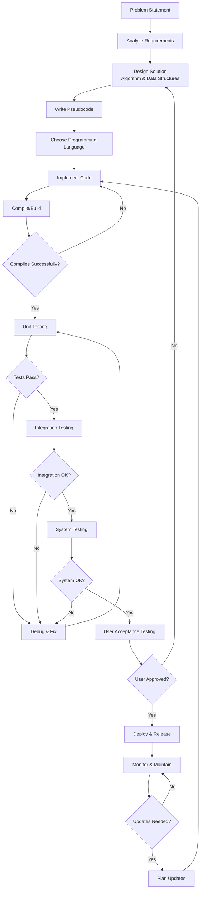

# 02. What is Programming?

## Introduction

Now that you understand computers in detail, let's dive deep into programming. Programming is the process of creating instructions for computers to follow. It's like writing a detailed recipe, giving directions to a friend, or composing music - but for computers! In this comprehensive chapter, we'll explore what programming really is, why it's incredibly valuable, the complete programming process, and everything you need to get started.

## What is Programming? - Detailed Explanation

**Programming** (also called coding or software development) is the art and science of writing instructions in a language that computers can understand. These instructions tell the computer what to do, step by step, to solve problems, automate tasks, or create applications.

### More Analogies to Understand Programming

#### 1. Cooking Recipe Analogy
Think of programming like writing a cooking recipe:
- **Ingredients** = Data (information the program uses)
- **Steps** = Instructions (what the computer does)
- **Kitchen Tools** = Programming constructs (variables, loops, functions)
- **Cooking Techniques** = Algorithms (methods to solve problems)
- **Final Dish** = Output (the result)

#### 2. Assembly Instructions Analogy
Like instructions for assembling furniture:
- **Parts List** = Variables and data structures
- **Step-by-step Guide** = Program logic
- **Tools Required** = Programming language features
- **Warnings** = Error handling
- **Finished Product** = Working software

#### 3. Musical Composition Analogy
Programming is like composing music:
- **Notes** = Individual commands
- **Rhythm** = Program flow and timing
- **Harmony** = How different parts work together
- **Structure** = Program organization
- **Performance** = Running the program

#### 4. Storytelling Analogy
Like writing a story:
- **Characters** = Objects and data
- **Plot** = Program logic
- **Setting** = Environment and context
- **Conflict** = Problems to solve
- **Resolution** = Program output

## Why Learn Programming? - Comprehensive Benefits

Programming is one of the most valuable skills you can learn in the 21st century. Here are detailed reasons:

### 1. Problem-Solving Excellence
- **Analytical Thinking**: Break down complex problems into manageable parts
- **Logical Reasoning**: Develop systematic approaches to challenges
- **Pattern Recognition**: Identify similarities in different problems
- **Creative Solutions**: Find innovative ways to solve problems

### 2. Creativity and Innovation
- **Digital Creation**: Build apps, games, websites, and software
- **Automation**: Create tools that work automatically
- **Innovation**: Develop new solutions to existing problems
- **Artistic Expression**: Combine logic with creative design

### 3. Career Opportunities and Financial Benefits
- **High Demand**: Tech industry needs millions of programmers
- **High Salary**: Programmers earn above-average salaries
- **Job Security**: Programming skills are always in demand
- **Entrepreneurship**: Start your own tech company
- **Remote Work**: Many programming jobs allow working from anywhere

### 4. Intellectual Development
- **Logical Thinking**: Improve your ability to think systematically
- **Mathematical Skills**: Programming involves math concepts
- **Attention to Detail**: Small errors can break entire programs
- **Persistence**: Debugging teaches patience and determination

### 5. Automation and Efficiency
- **Time Saving**: Automate repetitive tasks
- **Accuracy**: Computers don't make calculation errors
- **Scalability**: Programs can handle large amounts of work
- **Consistency**: Same task performed identically every time

### 6. Understanding Technology
- **Digital Literacy**: Understand how technology works
- **Tech Consumer Awareness**: Make informed decisions about software
- **Future-Proofing**: Technology is everywhere, programming knowledge helps
- **Empowerment**: Control technology instead of being controlled by it

### 7. Personal Growth
- **Confidence Building**: Accomplishing programming tasks builds confidence
- **Learning Ability**: Programming teaches how to learn complex subjects
- **Community**: Join a global community of programmers
- **Lifelong Learning**: Technology constantly evolves, so does programming

## The Complete Programming Process - Detailed

Programming follows a systematic, iterative approach. Here's the detailed process:

### Phase 1: Problem Analysis and Understanding
1. **Read the Problem Carefully**: Understand requirements completely
2. **Identify Inputs**: What data does the program need?
3. **Identify Outputs**: What should the program produce?
4. **Consider Constraints**: Time limits, memory limits, special conditions
5. **Edge Cases**: Think about unusual or extreme inputs
6. **Ask Questions**: Clarify any ambiguities

### Phase 2: Solution Planning and Design
1. **Break Down the Problem**: Divide into smaller, manageable subproblems
2. **Choose Algorithm**: Select appropriate method to solve each subproblem
3. **Data Structures**: Decide how to organize and store data
4. **User Interface**: Plan how users will interact with the program
5. **Error Handling**: Plan for potential problems
6. **Pseudocode**: Write informal description of solution

### Phase 3: Implementation (Writing Code)
1. **Choose Programming Language**: Based on project requirements
2. **Set Up Development Environment**: Install necessary tools
3. **Write Code**: Translate pseudocode into actual programming language
4. **Code Organization**: Use functions, classes, and modules appropriately
5. **Documentation**: Add comments explaining complex parts
6. **Version Control**: Use Git to track changes

### Phase 4: Testing and Debugging
1. **Unit Testing**: Test individual components
2. **Integration Testing**: Test how components work together
3. **System Testing**: Test the complete program
4. **User Acceptance Testing**: Test with real users
5. **Debugging**: Find and fix errors
6. **Performance Testing**: Check speed and resource usage

### Phase 5: Deployment and Maintenance
1. **Build Process**: Prepare program for distribution
2. **Deployment**: Make program available to users
3. **Documentation**: Create user manuals and technical docs
4. **Maintenance**: Fix bugs and add features
5. **Updates**: Release new versions with improvements

### Iterative Nature
Programming is rarely linear. You often:
- Go back to planning when implementation reveals issues
- Return to design when testing shows problems
- Continuously improve and refactor code

### Diagram: Detailed Programming Process



## Programming Languages - Comprehensive Overview

Programming languages are tools for writing code. There are hundreds of languages, each with unique strengths and purposes.

### High-Level vs. Low-Level Languages

#### Low-Level Languages
- **Machine Language**: Binary code (0s and 1s) - only computers understand
- **Assembly Language**: Mnemonics representing machine instructions
- **Advantages**: Fast, direct hardware control
- **Disadvantages**: Hard to learn, platform-specific

#### High-Level Languages
- **Abstracted**: Closer to human language
- **Portable**: Work on multiple platforms
- **Easier to Learn**: More readable and maintainable

### Popular Programming Languages - Detailed

#### Python
- **Creator**: Guido van Rossum (1991)
- **Paradigm**: Multi-paradigm (procedural, object-oriented, functional)
- **Strengths**: Beginner-friendly, versatile, large ecosystem
- **Uses**: Web development, data science, AI, automation, scientific computing
- **Companies**: Google, Netflix, Instagram, Spotify
- **Why Learn**: Easy to start, high demand, versatile

#### JavaScript
- **Creator**: Brendan Eich (1995)
- **Paradigm**: Multi-paradigm, prototype-based
- **Strengths**: Runs in browsers, asynchronous programming
- **Uses**: Web development, server-side (Node.js), mobile apps (React Native)
- **Companies**: All major tech companies
- **Why Learn**: Essential for web development, high demand

#### Java
- **Creator**: James Gosling (1995)
- **Paradigm**: Object-oriented, concurrent
- **Strengths**: Platform-independent ("Write once, run anywhere")
- **Uses**: Enterprise software, Android apps, web applications
- **Companies**: Google, Amazon, Netflix
- **Why Learn**: Strong OOP foundation, enterprise demand

#### C++
- **Creator**: Bjarne Stroustrup (1985)
- **Paradigm**: Multi-paradigm (procedural, object-oriented, generic)
- **Strengths**: High performance, hardware control, systems programming
- **Uses**: Game development, system software, embedded systems, high-performance computing
- **Companies**: Microsoft, Adobe, Electronic Arts
- **Why Learn**: Performance-critical applications, game development

#### C
- **Creator**: Dennis Ritchie (1972)
- **Paradigm**: Procedural, structured
- **Strengths**: Efficient, close to hardware, foundation for other languages
- **Uses**: System programming, embedded systems, operating systems
- **Companies**: Apple (macOS/iOS), Microsoft (Windows)
- **Why Learn**: Understanding computer fundamentals, systems programming

#### Other Notable Languages

##### C#
- **Creator**: Microsoft (2000)
- **Paradigm**: Object-oriented, component-oriented
- **Uses**: Windows applications, Unity game development, web services
- **Strengths**: Modern features, .NET ecosystem

##### PHP
- **Creator**: Rasmus Lerdorf (1995)
- **Paradigm**: Imperative, object-oriented
- **Uses**: Web development, server-side scripting
- **Strengths**: Easy web integration, large community

##### Ruby
- **Creator**: Yukihiro Matsumoto (1995)
- **Paradigm**: Object-oriented, scripting
- **Uses**: Web development (Ruby on Rails), automation
- **Strengths**: Elegant syntax, developer happiness

##### Swift
- **Creator**: Apple (2014)
- **Paradigm**: Object-oriented, protocol-oriented
- **Uses**: iOS/macOS apps, system programming
- **Strengths**: Safe, modern, fast

##### Go (Golang)
- **Creator**: Google (2009)
- **Paradigm**: Concurrent, imperative
- **Uses**: Systems programming, web services, cloud computing
- **Strengths**: Simple, efficient, built-in concurrency

##### Rust
- **Creator**: Mozilla (2010)
- **Paradigm**: Multi-paradigm, systems programming
- **Uses**: System programming, web assembly, performance-critical code
- **Strengths**: Memory safety, zero-cost abstractions

### Choosing a Programming Language - Decision Framework

#### For Beginners
1. **Python**: Most beginner-friendly, versatile
2. **JavaScript**: Essential for web, interactive learning
3. **Scratch**: Visual programming for kids (not text-based)

#### Based on Career Goals
- **Web Development**: JavaScript, HTML/CSS, Python (Django/Flask)
- **Mobile Apps**: Java/Kotlin (Android), Swift (iOS), React Native (Cross-platform)
- **Game Development**: C++, C#, Unity (C#)
- **Data Science**: Python, R
- **System Programming**: C, C++, Rust
- **Enterprise Software**: Java, C#

#### Based on Project Type
- **Quick Prototyping**: Python, JavaScript
- **High Performance**: C++, Rust, Go
- **Web Applications**: JavaScript, Python, PHP, Ruby
- **Desktop Applications**: Java, C#, Python
- **Embedded Systems**: C, C++, Rust

#### Language Comparison Table

| Language | Difficulty | Speed | Popularity | Use Cases |
|----------|------------|-------|------------|-----------|
| Python | Easy | Medium | Very High | Web, Data Science, AI |
| JavaScript | Medium | Medium | Very High | Web, Mobile, Servers |
| Java | Medium | Fast | High | Enterprise, Android |
| C++ | Hard | Very Fast | High | Games, Systems |
| C | Hard | Very Fast | Medium | Systems, Embedded |
| C# | Medium | Fast | High | Windows, Games |
| PHP | Easy | Medium | Medium | Web Development |
| Ruby | Easy | Medium | Medium | Web (Rails) |

## Basic Programming Concepts - Expanded

Here are fundamental concepts you'll encounter, explained in detail:

### 1. Variables - Data Containers
- **Definition**: Named storage locations in memory
- **Purpose**: Store and manipulate data
- **Naming Rules**: Letters, numbers, underscores; start with letter/underscore
- **Scope**: Where variable is accessible (local vs global)
- **Lifetime**: How long variable exists

### 2. Data Types - Information Categories
- **Primitive Types**: Basic building blocks
  - **Integer**: Whole numbers (-2, -1, 0, 1, 2...)
  - **Float/Double**: Decimal numbers (3.14, -2.5)
  - **Character**: Single letters/symbols ('A', '!')
  - **Boolean**: True/False values
- **Composite Types**: Collections of primitives
  - **Strings**: Text ("Hello World")
  - **Arrays**: Fixed-size collections
  - **Lists**: Dynamic collections

### 3. Operators - Data Manipulators
- **Arithmetic**: +, -, *, /, % (modulo), ** (power)
- **Comparison**: ==, !=, <, >, <=, >=
- **Logical**: && (and), || (or), ! (not)
- **Assignment**: =, +=, -=, *=, /=
- **Bitwise**: &, |, ^, ~, <<, >>

### 4. Control Structures - Program Flow Controllers
- **Sequential**: Execute statements in order
- **Selection**: Choose between alternatives (if-else, switch)
- **Iteration**: Repeat actions (for, while, do-while)

### 5. Functions - Reusable Code Blocks
- **Definition**: Named blocks of code that perform specific tasks
- **Parameters**: Input values
- **Return Values**: Output results
- **Scope**: Local variables inside functions
- **Recursion**: Functions calling themselves

## Types of Programming Paradigms - Detailed

### 1. Procedural Programming
- **Approach**: Step-by-step instructions using procedures/functions
- **Focus**: Actions and logic flow
- **Languages**: C, Pascal, BASIC
- **Advantages**: Simple, efficient, easy to learn
- **Example**: Recipe following

### 2. Object-Oriented Programming (OOP)
- **Approach**: Organize code around objects that have data and behavior
- **Principles**: Encapsulation, inheritance, polymorphism, abstraction
- **Languages**: Java, C++, Python, C#
- **Advantages**: Modularity, reusability, maintainability
- **Example**: Modeling real-world objects

### 3. Functional Programming
- **Approach**: Treat computation as mathematical functions
- **Principles**: Pure functions, immutability, higher-order functions
- **Languages**: Haskell, Lisp, Erlang, Scala
- **Advantages**: Concurrency, testability, mathematical reasoning
- **Example**: Mathematical function composition

### 4. Scripting Programming
- **Approach**: Write small programs for automation and task automation
- **Focus**: Quick solutions, glue code between systems
- **Languages**: Python, Perl, Ruby, Bash
- **Advantages**: Rapid development, system integration
- **Example**: Automating file operations

### 5. Logic Programming
- **Approach**: Define relationships and let computer find solutions
- **Focus**: What to compute, not how
- **Languages**: Prolog, Datalog
- **Advantages**: Declarative, AI applications
- **Example**: Expert systems, database queries

### 6. Concurrent/Parallel Programming
- **Approach**: Multiple computations executing simultaneously
- **Focus**: Performance, responsiveness
- **Languages**: Go, Erlang, Clojure
- **Advantages**: Better resource utilization, faster execution
- **Example**: Web servers handling multiple requests

## Your First Programs - Multiple Examples

### "Hello, World!" in Different Languages

#### Python
```python
print("Hello, World!")
```

#### JavaScript (Browser Console)
```javascript
console.log("Hello, World!");
```

#### Java
```java
public class HelloWorld {
    public static void main(String[] args) {
        System.out.println("Hello, World!");
    }
}
```

#### C++
```cpp
#include <iostream>

int main() {
    std::cout << "Hello, World!" << std::endl;
    return 0;
}
```

#### C
```c
#include <stdio.h>

int main() {
    printf("Hello, World!\n");
    return 0;
}
```

#### Ruby
```ruby
puts "Hello, World!"
```

#### PHP
```php
<?php
echo "Hello, World!";
?>
```

### Simple Interactive Program (Python)
```python
# Get user input
name = input("What is your name? ")
age = int(input("How old are you? "))

# Process data
birth_year = 2024 - age

# Display output
print(f"Hello, {name}!")
print(f"You were born in {birth_year}.")
print(f"Next year, you'll be {age + 1} years old.")
```

## Common Programming Terms - Expanded Glossary

### Core Concepts
- **Algorithm**: Step-by-step procedure for solving a problem
- **Data Structure**: Way to organize and store data
- **Variable**: Named storage location for data
- **Constant**: Fixed value that doesn't change
- **Expression**: Combination of variables, operators, and values
- **Statement**: Complete instruction that performs an action

### Code Quality
- **Syntax**: Rules for writing correct code
- **Semantics**: Meaning of the code
- **Style**: Conventions for readable code
- **Documentation**: Comments and explanations in code
- **Refactoring**: Improving code without changing functionality

### Error Handling
- **Bug**: Error in code that causes incorrect behavior
- **Debugging**: Process of finding and fixing bugs
- **Exception**: Runtime error that disrupts normal execution
- **Error Handling**: Code that deals with potential errors
- **Testing**: Verifying code works correctly

### Development Process
- **Compiler**: Translates high-level code to machine code
- **Interpreter**: Executes code line by line
- **IDE**: Integrated Development Environment with tools
- **Version Control**: System for tracking code changes (Git)
- **Build**: Process of converting source code to executable
- **Deployment**: Making software available to users

### Advanced Concepts
- **Abstraction**: Hiding complex details, showing only essentials
- **Modularity**: Breaking code into independent, reusable parts
- **Encapsulation**: Bundling data and methods that operate on data
- **Inheritance**: Creating new classes from existing ones
- **Polymorphism**: Same interface, different implementations

## Programming Environments - Complete Setup Guide

### Essential Tools

#### 1. Text Editors
- **Visual Studio Code (VS Code)**: Free, extensible, most popular
- **Sublime Text**: Fast, lightweight
- **Atom**: Customizable, GitHub product
- **Notepad++**: Simple, Windows-only

#### 2. Integrated Development Environments (IDEs)
- **PyCharm**: Best for Python development
- **IntelliJ IDEA**: Excellent for Java, JavaScript
- **Visual Studio**: Microsoft's comprehensive IDE
- **Eclipse**: Open-source, extensible IDE
- **Xcode**: Apple's IDE for macOS/iOS development

#### 3. Compilers and Interpreters
- **Python Interpreter**: python.org
- **Node.js**: For JavaScript (nodejs.org)
- **JDK**: Java Development Kit (oracle.com)
- **GCC**: GNU Compiler Collection for C/C++
- **.NET SDK**: For C# development

#### 4. Version Control
- **Git**: Distributed version control system
- **GitHub**: Online platform for Git repositories
- **GitLab**: Alternative to GitHub
- **Bitbucket**: Atlassian's Git solution

### Setting Up Your Environment

#### For Python Development
1. Download Python from python.org
2. Install VS Code
3. Install Python extension for VS Code
4. Install Git
5. Create GitHub account

#### For Web Development
1. Install VS Code
2. Install Node.js
3. Install Live Server extension
4. Install Git
5. Learn HTML, CSS, JavaScript

#### For Java Development
1. Download JDK
2. Install IntelliJ IDEA or Eclipse
3. Install Git
4. Learn Java syntax and OOP

### Online Development Environments
- **Repl.it**: Browser-based coding
- **CodePen**: For HTML/CSS/JavaScript
- **JSFiddle**: JavaScript testing
- **PythonAnywhere**: Python in browser
- **Glitch**: Web app development

## Programming Communities and Learning Resources

### Online Learning Platforms
- **Codecademy**: Interactive coding lessons
- **freeCodeCamp**: Free comprehensive curriculum
- **Coursera**: University courses
- **edX**: Online education platform
- **Udemy**: Video courses
- **Khan Academy**: Free programming tutorials

### Practice Platforms
- **LeetCode**: Algorithm problems
- **HackerRank**: Coding challenges
- **CodeChef**: Programming contests
- **CodeForces**: Competitive programming
- **Exercism**: Language-specific exercises

### Communities
- **Stack Overflow**: Q&A for programmers
- **Reddit**: r/learnprogramming, r/coding
- **Discord**: Coding servers
- **Dev.to**: Developer blogging
- **GitHub**: Open source collaboration

### Books
- **"Automate the Boring Stuff with Python"** by Al Sweigart
- **"Eloquent JavaScript"** by Marijn Haverbeke
- **"Head First Java"** by Kathy Sierra
- **"The Pragmatic Programmer"** by Andrew Hunt

## Career Paths in Programming

### Frontend Developer
- **Skills**: HTML, CSS, JavaScript, React, Vue.js
- **Focus**: User interface and user experience
- **Salary**: High demand, good compensation

### Backend Developer
- **Skills**: Server-side languages, databases, APIs
- **Focus**: Server logic, data processing
- **Salary**: Strong demand, excellent pay

### Full-Stack Developer
- **Skills**: Both frontend and backend technologies
- **Focus**: Complete web applications
- **Salary**: Highest demand, best compensation

### Data Scientist
- **Skills**: Python, R, statistics, machine learning
- **Focus**: Data analysis and insights
- **Salary**: High, growing field

### DevOps Engineer
- **Skills**: Cloud platforms, automation, security
- **Focus**: Development and operations integration
- **Salary**: Excellent, specialized field

### Mobile App Developer
- **Skills**: iOS (Swift), Android (Java/Kotlin), React Native
- **Focus**: Mobile applications
- **Salary**: Strong demand, good pay

## Summary

Programming is the art of instructing computers to solve problems and perform tasks. It combines creativity, logic, and systematic thinking to create software that powers our digital world. From simple "Hello, World!" programs to complex applications, programming offers endless possibilities for innovation and problem-solving.

The programming process involves understanding problems, planning solutions, writing code, testing thoroughly, and maintaining software. With numerous programming languages and paradigms available, you can choose tools that best fit your goals and projects.

As you begin your programming journey, remember that everyone starts as a beginner. The key is consistent practice, learning from mistakes, and building projects. Join programming communities, work on real projects, and never stop learning. The world of programming is vast and exciting - welcome aboard!

## Exercises - Comprehensive Practice

### Basic Understanding
1. **Explain programming** in your own words, using an analogy.
2. **Compare programming** to something you do in daily life.
3. **List five reasons** why learning programming is valuable.

### Programming Process
4. **Describe the programming process** for making a peanut butter sandwich.
5. **Write pseudocode** for calculating the area of a rectangle.
6. **Identify the phases** in the programming process for a simple calculator.

### Languages and Tools
7. **Compare Python and JavaScript** - when would you use each?
8. **Research and describe** three programming languages you haven't learned.
9. **Explain the difference** between a compiler and an interpreter.

### Problem Solving
10. **Break down** the problem of finding the largest number in a list.
11. **Write pseudocode** for checking if a number is prime.
12. **Design an algorithm** for sorting three numbers.

### Practical Application
13. **Plan a simple program** that manages a to-do list.
14. **Design a program** that converts temperatures between Celsius and Fahrenheit.
15. **Create pseudocode** for a basic quiz program.

### Advanced Thinking
16. **Consider ethics** - what programming practices should you avoid?
17. **Think about careers** - what kind of programming interests you most?
18. **Plan your learning** - create a 3-month programming learning roadmap.

## Further Reading and Resources

### Beginner Books
- **"Python Crash Course"** by Eric Matthes
- **"JavaScript and jQuery"** by Jon Duckett
- **"Head First Programming"** by David Griffiths

### Online Learning Platforms
- **Codecademy**: codecademy.com
- **freeCodeCamp**: freecodecamp.org
- **Khan Academy**: khanacademy.org/computing
- **Coursera**: coursera.org
- **edX**: edx.org

### Practice and Challenges
- **LeetCode**: leetcode.com
- **HackerRank**: hackerrank.com
- **CodeChef**: codechef.com
- **Project Euler**: projecteuler.net

### Communities
- **Stack Overflow**: stackoverflow.com
- **Reddit**: reddit.com/r/learnprogramming
- **GitHub**: github.com
- **Dev.to**: dev.to

Remember: Programming is a skill that improves with practice. Start small, be patient with yourself, and celebrate your progress. Every expert programmer was once a beginner!