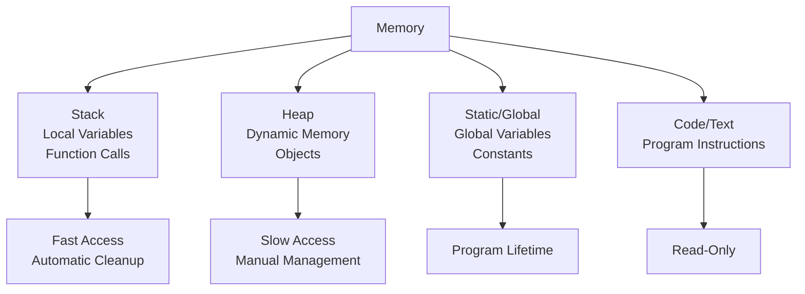

# 04. Basic Concepts: Variables and Data Types

## Introduction

Now that you understand computers and programming languages in depth, let's explore the fundamental building blocks of programming: variables and data types. These concepts form the foundation of all programming, enabling you to store, manipulate, and organize information in your programs. This comprehensive chapter will delve deep into variables, data types, memory management, type systems, and advanced concepts with extensive examples and detailed explanations.

## What are Variables? - Comprehensive Understanding

A **variable** is a named storage location in computer memory that holds a value. Think of it as a labeled container or box where you can store, retrieve, and modify different types of information. Variables are the basic units of data storage and manipulation in programming.

### Core Characteristics of Variables

1. **Named Storage**: Each variable has a unique identifier (name)
2. **Memory Allocation**: Variables occupy specific memory locations
3. **Type Association**: Variables are associated with data types
4. **Value Storage**: Variables can hold different values during program execution
5. **Scope and Lifetime**: Variables have defined accessibility and existence duration

### Variable Declaration and Initialization

**Declaration** reserves memory space and associates a name with it.
**Initialization** assigns an initial value to the variable.

#### Static vs. Dynamic Declaration

**Statically Typed Languages** (Java, C++):
- Variables must be declared with explicit types
- Type checking occurs at compile time
- Memory allocation is determined at compile time

**Dynamically Typed Languages** (Python, JavaScript):
- Variables can be declared without explicit types
- Type checking occurs at runtime
- Types can change during execution

#### Declaration Syntax Across Languages

**Python (Dynamic Typing):**
```python
# Declaration and initialization in one step
age = 25
name = "Alice"
is_student = True

# Multiple assignment
x, y, z = 1, 2, 3

# Same value to multiple variables
a = b = c = 10
```

**JavaScript (Dynamic Typing):**
```javascript
// var (deprecated, function scope)
var oldStyle = "old";

// let (block scope, reassignable)
let age = 25;
age = 30; // OK

// const (block scope, immutable)
const PI = 3.14159;
// PI = 3.14; // Error: cannot reassign

// Declaration without initialization
let uninitialized; // undefined
```

**Java (Static Typing):**
```java
// Primitive types
int age = 25;
double salary = 50000.50;
boolean isEmployed = true;
char grade = 'A';

// Reference types
String name = "Alice";
Integer wrapperAge = 25; // Wrapper class

// Arrays
int[] numbers = {1, 2, 3, 4, 5};
String[] names = new String[10];
```

**C++ (Static Typing):**
```cpp
#include <iostream>
#include <string>

int main() {
    // Basic types
    int age = 25;
    double height = 5.8;
    bool isStudent = true;
    char initial = 'A';
    
    // Strings
    std::string name = "Alice";
    
    // Constants
    const double PI = 3.14159;
    
    // References
    int& refAge = age; // Reference to age
    
    // Pointers
    int* ptrAge = &age; // Pointer to age
    
    return 0;
}
```

### Variable Naming Conventions and Best Practices

#### Naming Rules (Universal)
- Must start with letter or underscore (_)
- Can contain letters, numbers, and underscores
- Case-sensitive (myVar ≠ myvar)
- No spaces or special characters (except _)
- Cannot be reserved keywords

#### Language-Specific Naming Conventions

**Python (PEP 8):**
- Use lowercase with underscores: `user_name`, `total_price`
- Constants in uppercase: `MAX_SIZE`, `PI_VALUE`
- Private variables with leading underscore: `_private_var`

**JavaScript:**
- camelCase for variables: `userName`, `totalPrice`
- PascalCase for classes: `UserClass`, `DataProcessor`
- UPPER_SNAKE_CASE for constants: `MAX_SIZE`, `API_KEY`

**Java:**
- camelCase for variables/methods: `userName`, `calculateTotal()`
- PascalCase for classes: `UserClass`, `DataProcessor`
- UPPER_SNAKE_CASE for constants: `MAX_SIZE`, `DEFAULT_PORT`

**C++:**
- Similar to Java, with additional conventions for pointers/references
- `p_` prefix for pointers: `p_data`, `p_user`
- `m_` prefix for member variables: `m_name`, `m_age`

#### Hungarian Notation (Legacy)
- Prefix indicates type: `strName`, `iAge`, `bIsValid`
- Less common in modern code but still used in some systems

### Variable Name Quality Assessment

| Excellent | Good | Poor | Terrible | Why |
|-----------|------|------|----------|-----|
| `userEmailAddress` | `email` | `e` | `x` | Descriptive and clear |
| `totalPriceInCents` | `price` | `p` | `temp` | Specific and meaningful |
| `isUserLoggedIn` | `loggedIn` | `flag` | `a` | Purpose is evident |
| `maximumRetryCount` | `retries` | `r` | `var1` | Context is clear |

## Data Types - Comprehensive Classification System

Data types define the nature of data that can be stored in variables and specify the operations that can be performed on that data. They determine memory allocation, value ranges, and allowed operations.

### Type System Classification

#### 1. Static vs. Dynamic Typing
- **Static Typing**: Types checked at compile time (Java, C++, C#)
- **Dynamic Typing**: Types checked at runtime (Python, JavaScript, Ruby)
- **Gradual Typing**: Optional static types (TypeScript, Python with annotations)

#### 2. Strong vs. Weak Typing
- **Strong Typing**: Strict type enforcement, no implicit conversions (Python, Java)
- **Weak Typing**: Loose type enforcement, implicit conversions allowed (JavaScript, C)

#### 3. Manifest vs. Inferred Typing
- **Manifest**: Explicit type declarations required (Java, C++)
- **Inferred**: Types deduced by compiler/interpreter (Haskell, Scala)

### Primitive Data Types - Fundamental Building Blocks

#### 1. Integer Types - Whole Numbers
**Characteristics:**
- Store whole numbers (positive, negative, zero)
- Fixed precision, no decimal places
- Most efficient for counting and indexing

**Language-Specific Implementations:**

**Python:**
```python
# Arbitrary precision integers
small_number = 42
large_number = 999999999999999999999999999999
negative = -17

# Different bases
binary = 0b1010    # 10 in decimal
octal = 0o12       # 10 in decimal
hexadecimal = 0xA  # 10 in decimal
```

**Java:**
```java
// Fixed-size integers
byte tiny = 127;           // 8 bits: -128 to 127
short small = 32767;       // 16 bits: -32,768 to 32,767
int normal = 2147483647;   // 32 bits: -2^31 to 2^31-1
long big = 9223372036854775807L; // 64 bits: -2^63 to 2^63-1
```

**JavaScript:**
```javascript
// All numbers are 64-bit floating point (IEEE 754)
let integer = 42;
let bigInt = 9007199254740991n; // BigInt for arbitrary precision
```

**C++:**
```cpp
#include <cstdint> // For fixed-width integers

int8_t byte = 127;         // Exactly 8 bits
int16_t short_int = 32767; // Exactly 16 bits
int32_t int32 = 2147483647;// Exactly 32 bits
int64_t int64 = 9223372036854775807LL; // Exactly 64 bits
```

#### 2. Floating-Point Types - Decimal Numbers
**Characteristics:**
- Store decimal numbers with fractional parts
- Approximate representation (limited precision)
- Support scientific notation

**IEEE 754 Standard:**
- **Single Precision (32-bit)**: ~7 decimal digits precision
- **Double Precision (64-bit)**: ~15 decimal digits precision

**Examples:**
```python
# Python floats (double precision)
pi = 3.141592653589793
scientific = 1.23e-4  # 0.000123
negative_float = -2.5

# Precision limitations
print(0.1 + 0.2)  # 0.30000000000000004 (not exactly 0.3)
```

```java
// Java floating point
float singlePrecision = 3.14159f;     // 32-bit
double doublePrecision = 3.141592653589793; // 64-bit

// Special values
double infinity = Double.POSITIVE_INFINITY;
double notANumber = Double.NaN;
```

```javascript
// JavaScript numbers (all 64-bit float)
let pi = 3.141592653589793;
let scientific = 1.23e-4;
let result = 0.1 + 0.2; // 0.30000000000000004
```

#### 3. Character Types - Individual Characters
**Characteristics:**
- Store single characters
- Usually represented as integer codes (ASCII/Unicode)

```java
char letter = 'A';        // 65 in ASCII
char digit = '5';         // 53 in ASCII
char symbol = '@';        // 64 in ASCII
char unicode = '\u03A0';  // Π (Greek Pi)
```

```c
#include <stdio.h>

int main() {
    char letter = 'A';           // 65 in ASCII
    char newline = '\n';         // Escape sequence
    char tab = '\t';            // Tab character
    printf("Letter: %c, ASCII: %d\n", letter, letter);
    return 0;
}
```

#### 4. Boolean Types - True/False Values
**Characteristics:**
- Only two possible values: true or false
- Fundamental for decision making and logic

```python
# Python booleans
is_active = True
is_admin = False

# Boolean operations
result = True and False  # False
comparison = 5 > 3       # True
```

```java
// Java booleans
boolean isLoggedIn = true;
boolean hasPermission = false;

// Boolean in conditions
if (isLoggedIn && hasPermission) {
    // Grant access
}
```

### Composite Data Types - Collections and Structures

#### 1. Arrays - Fixed-Size Collections
**Characteristics:**
- Fixed size determined at creation
- Homogeneous elements (same type)
- Random access by index
- Contiguous memory allocation

```python
# Python lists (dynamic arrays)
numbers = [1, 2, 3, 4, 5]
names = ["Alice", "Bob", "Charlie"]

# Access by index
first_number = numbers[0]  # 1
last_name = names[-1]      # "Charlie"

# Slicing
subset = numbers[1:4]      # [2, 3, 4]
```

```java
// Java arrays
int[] numbers = {1, 2, 3, 4, 5};
String[] names = new String[3];
names[0] = "Alice";

// Multi-dimensional arrays
int[][] matrix = {
    {1, 2, 3},
    {4, 5, 6},
    {7, 8, 9}
};
```

```c
#include <stdio.h>

int main() {
    // C arrays
    int numbers[5] = {1, 2, 3, 4, 5};
    char name[20] = "Alice";
    
    // Array access
    printf("First: %d\n", numbers[0]);
    printf("Name: %s\n", name);
    
    return 0;
}
```

#### 2. Strings - Text Sequences
**Characteristics:**
- Sequences of characters
- Immutable in some languages, mutable in others
- Rich set of string manipulation methods

```python
# Python strings (immutable)
text = "Hello, World!"
uppercase = text.upper()      # "HELLO, WORLD!"
lowercase = text.lower()      # "hello, world!"
length = len(text)           # 13

# String formatting
name = "Alice"
age = 25
message = f"{name} is {age} years old"
```

```java
// Java strings (immutable)
String text = "Hello, World!";
String uppercase = text.toUpperCase();  // "HELLO, WORLD!"
int length = text.length();             // 13

// String concatenation
String greeting = "Hello" + " " + "World!";

// StringBuilder for mutable strings
StringBuilder builder = new StringBuilder();
builder.append("Hello").append(" ").append("World!");
String result = builder.toString();
```

```javascript
// JavaScript strings
let text = "Hello, World!";
let uppercase = text.toUpperCase();  // "HELLO, WORLD!"
let length = text.length;            // 13

// Template literals
let name = "Alice";
let age = 25;
let message = `${name} is ${age} years old`;
```

#### 3. Structures/Classes - Custom Data Types
**Purpose:** Group related data together

```c
// C structures
struct Person {
    char name[50];
    int age;
    float height;
};

int main() {
    struct Person person1;
    strcpy(person1.name, "Alice");
    person1.age = 25;
    person1.height = 5.6;
    
    printf("Name: %s, Age: %d\n", person1.name, person1.age);
    return 0;
}
```

```java
// Java classes
public class Person {
    private String name;
    private int age;
    private double height;
    
    public Person(String name, int age, double height) {
        this.name = name;
        this.age = age;
        this.height = height;
    }
    
    // Getters and setters...
}
```

### Advanced Type Concepts

#### 1. Type Aliases and Custom Types
```python
# Python type hints (Python 3.5+)
from typing import List, Dict, Tuple

# Type aliases
Vector2D = Tuple[float, float]
PersonData = Dict[str, Union[str, int]]

def create_person(name: str, age: int) -> PersonData:
    return {"name": name, "age": age}

# Usage
person: PersonData = create_person("Alice", 25)
```

```c
// C type aliases
typedef unsigned char byte;
typedef struct {
    int x, y;
} Point;

// Usage
byte data = 255;
Point location = {10, 20};
```

#### 2. Enumerations - Named Constants
```python
from enum import Enum

class Color(Enum):
    RED = 1
    GREEN = 2
    BLUE = 3

# Usage
favorite = Color.RED
print(favorite.name)    # "RED"
print(favorite.value)   # 1
```

```java
public enum Color {
    RED, GREEN, BLUE
}

// Usage
Color favorite = Color.RED;
System.out.println(favorite); // "RED"
```

#### 3. Union Types - Multiple Possible Types
```c
// C unions (share memory)
union Data {
    int integer;
    float decimal;
    char character;
};

int main() {
    union Data value;
    value.integer = 42;
    printf("Integer: %d\n", value.integer);
    
    value.decimal = 3.14f;
    printf("Decimal: %f\n", value.decimal);
    
    return 0;
}
```

### Memory Representation and Management

#### Memory Layout Diagram



#### Memory Allocation Strategies

**Static Allocation:**
- Memory allocated at compile time
- Fixed size and location
- Examples: global variables, static variables

**Stack Allocation:**
- Automatic allocation/deallocation
- Fast access
- Limited lifetime (function scope)
- Examples: local variables, function parameters

**Heap Allocation:**
- Dynamic allocation at runtime
- Manual management (most languages)
- Flexible lifetime
- Examples: objects, dynamic arrays

#### Garbage Collection
**Automatic memory management in modern languages:**
- **Reference Counting** (Python, PHP): Count references to objects
- **Mark and Sweep** (Java, JavaScript): Trace reachable objects
- **Generational GC**: Separate young/old objects for efficiency

### Type Conversion and Casting

#### Implicit Conversion (Coercion)
```python
# Python implicit conversion
result = 5 + 2.5  # int + float = float (7.5)
message = "Age: " + str(25)  # Automatic string conversion
```

```javascript
// JavaScript type coercion
result = 5 + "10"  # "510" (string concatenation)
truthy = !!5       # true (number to boolean)
```

#### Explicit Conversion (Casting)
```java
// Java explicit casting
int integer = 42;
double decimal = (double) integer;  // int to double

double pi = 3.14159;
int truncated = (int) pi;  // 3 (loses precision)
```

```c
// C explicit casting
int integer = 42;
double decimal = (double) integer;

double pi = 3.14159;
int truncated = (int) pi;  // 3
```

### Advanced Variable Concepts

#### 1. References vs. Values
**Value Types:** Store actual values (primitives)
**Reference Types:** Store memory addresses (objects)

```java
// Java demonstration
int primitive = 42;           // Value type
Integer wrapper = 42;         // Reference type

// Modifying value type
int another = primitive;
another = 100;
// primitive is still 42

// Modifying reference type
Integer[] array1 = {1, 2, 3};
Integer[] array2 = array1;    // Same reference
array2[0] = 999;
// array1[0] is now 999
```

#### 2. Variable Shadowing
```python
global_var = "global"

def example():
    global_var = "local"  # Shadows global variable
    print(global_var)     # "local"
    
    def inner():
        global_var = "inner"  # Shadows outer local
        print(global_var)   # "inner"
    
    inner()
    print(global_var)     # "local"

example()
print(global_var)  # "global"
```

#### 3. Variable Lifetimes and Scope

**Global Scope:** Accessible everywhere
**Module/File Scope:** Accessible within file
**Function Scope:** Accessible within function
**Block Scope:** Accessible within block (if, loops)

```javascript
// JavaScript scope demonstration
let globalVar = "global";

function outerFunction() {
    let outerVar = "outer";
    
    function innerFunction() {
        let innerVar = "inner";
        console.log(globalVar);  // accessible
        console.log(outerVar);   // accessible
        console.log(innerVar);   // accessible
    }
    
    innerFunction();
    console.log(innerVar);  // ReferenceError
}

outerFunction();
```

### Constants and Immutability

#### Constants
```python
# Python constants (by convention)
PI = 3.14159
MAX_USERS = 100

# Can still be changed (convention only)
PI = 3.14  # Not recommended
```

```java
// Java constants
final double PI = 3.14159;
final int MAX_USERS = 100;
// PI = 3.14; // Compile error
```

#### Immutable Objects
```python
# Tuples are immutable
coordinates = (10, 20)
# coordinates[0] = 15  # TypeError

# Frozen sets
frozen = frozenset([1, 2, 3])
# frozen.add(4)  # AttributeError
```

### Best Practices and Common Patterns

#### 1. Variable Initialization
```python
# Good: Initialize with meaningful values
user_name = ""
total_amount = 0.0
is_active = False

# Bad: Uninitialized variables
user_name  # Undefined behavior
```

#### 2. Type Hints (Modern Python)
```python
from typing import List, Optional

def process_users(users: List[str], max_count: Optional[int] = None) -> List[str]:
    if max_count:
        return users[:max_count]
    return users
```

#### 3. Defensive Programming
```python
# Check types and values
def divide_numbers(a: float, b: float) -> float:
    if not isinstance(a, (int, float)) or not isinstance(b, (int, float)):
        raise ValueError("Both arguments must be numbers")
    if b == 0:
        raise ZeroDivisionError("Cannot divide by zero")
    return a / b
```

### Common Errors and Debugging

#### 1. Type-Related Errors
```python
# Python
result = "5" + 3  # TypeError: can only concatenate str to str

# Java
int number = "123";  // Compile error: incompatible types
```

#### 2. Scope Errors
```python
def function():
    local_var = "local"
    return local_var

print(local_var)  # NameError: name 'local_var' is not defined
```

#### 3. Memory Issues
```c
// C memory leak
int* array = malloc(100 * sizeof(int));
// Forgot to free(array);

// Dangling pointer
int* ptr = &some_variable;
// some_variable goes out of scope
// ptr now points to invalid memory
```

### Performance Considerations

#### Memory Usage by Data Types
| Type | Memory (bytes) | Range |
|------|----------------|-------|
| bool | 1 | true/false |
| byte | 1 | -128 to 127 |
| short | 2 | -32,768 to 32,767 |
| int | 4 | -2^31 to 2^31-1 |
| long | 8 | -2^63 to 2^63-1 |
| float | 4 | ~7 decimal digits |
| double | 8 | ~15 decimal digits |
| char | 2 | Unicode characters |

#### Optimization Tips
1. **Choose appropriate data types** for memory efficiency
2. **Use primitive types** when possible (faster than objects)
3. **Avoid unnecessary conversions** between types
4. **Consider memory alignment** in performance-critical code
5. **Profile memory usage** in large applications

### Summary

Variables and data types are the foundation of programming. Understanding how different languages handle types, memory management, and variable scoping is crucial for writing efficient, maintainable code. From primitive types to complex data structures, the type system of a language determines what you can build and how efficiently your programs will run.

## Exercises - Comprehensive Practice

### Basic Variable Operations
1. **Multi-language Declaration**: Declare variables for name, age, salary, and active status in Python, Java, and JavaScript.
2. **Type Conversion**: Write code to convert between strings, integers, and floats in your chosen language.
3. **Variable Swapping**: Swap the values of two variables without using a temporary variable.

### Data Type Mastery
4. **Range Testing**: Write a program that demonstrates the range limits of different integer types.
5. **Precision Testing**: Show the precision limitations of floating-point numbers.
6. **String Manipulation**: Implement common string operations (concatenation, substring, search).

### Memory and Scope
7. **Scope Analysis**: Create nested functions and demonstrate variable scope rules.
8. **Memory Tracking**: In a language with manual memory management, track allocation and deallocation.
9. **Reference vs. Value**: Demonstrate the difference between pass-by-value and pass-by-reference.

### Advanced Concepts
10. **Custom Types**: Define a structure/class to represent a person with multiple attributes.
11. **Type Safety**: Write code that demonstrates type checking and error handling.
12. **Performance Comparison**: Compare the performance of different data types for the same operation.

### Real-World Application
13. **Data Processing**: Create a program that reads data from a file, processes it using different data types, and writes results.
14. **Configuration Management**: Build a configuration system using constants and environment variables.
15. **Validation System**: Implement input validation using different data types and constraints.

## Further Reading and Resources

### Books
- **"Types and Programming Languages"** by Benjamin C. Pierce
- **"Effective Java"** by Joshua Bloch (for Java types)
- **"Python Data Science Handbook"** by Jake VanderPlas

### Online Resources
- **Language Documentation**: Official type system documentation
- **TypeScript Handbook**: Advanced typing concepts
- **Rust Book**: Memory safety and types

### Academic Papers
- **"The Essence of the Iterator Pattern"** - Understanding generic types
- **"Design and Implementation of Generics for the .NET Common Language Runtime"**
- **"Region-Based Memory Management"** - Advanced memory management

Remember: Mastering variables and data types is fundamental to becoming a proficient programmer. The type system of your chosen language will shape how you think about and solve problems.

### Type Conversion

Sometimes you need to convert between data types:

**Implicit Conversion** (automatic):
```python
age = 25        # int
height = 5.9    # float
total = age + height  # Result: 30.9 (float)
```

**Explicit Conversion** (manual):
```python
# Python
num_str = "42"
num_int = int(num_str)  # Converts string to int

# JavaScript
let num = 42;
let str = num.toString();  // Converts number to string
```

## Constants

Constants are variables whose values cannot be changed after initialization. Use them for fixed values.

**Python:**
```python
PI = 3.14159
MAX_USERS = 100
```

**JavaScript:**
```javascript
const PI = 3.14159;
const MAX_USERS = 100;
```

**Java:**
```java
final double PI = 3.14159;
final int MAX_USERS = 100;
```

## Scope and Lifetime

- **Scope**: Where a variable is accessible
- **Lifetime**: How long a variable exists in memory

### Local vs. Global Variables

```python
global_var = "I'm global"

def my_function():
    local_var = "I'm local"
    print(global_var)  # Accessible
    print(local_var)   # Accessible

my_function()
print(global_var)  # Accessible
print(local_var)   # Error: not defined
```

## Best Practices

1. **Initialize Variables**: Always give variables initial values.
2. **Use Meaningful Names**: Make your code self-documenting.
3. **Choose Appropriate Types**: Use the smallest type that fits your needs.
4. **Avoid Global Variables**: Use them sparingly to prevent conflicts.
5. **Comment Your Code**: Explain what variables store.

## Common Errors

1. **Undefined Variable**: Using a variable before declaring it.
2. **Type Mismatch**: Assigning wrong type of value.
3. **Scope Error**: Accessing a variable outside its scope.

## Examples in Different Languages

### Python
```python
# Variables and data types
name = "Alice"          # String
age = 30                # Integer
height = 5.6            # Float
is_student = True       # Boolean

print(f"{name} is {age} years old, {height} feet tall, student: {is_student}")
```

### JavaScript
```javascript
// Variables and data types
let name = "Alice";      // String
let age = 30;            // Number
let height = 5.6;        // Number
let isStudent = true;    // Boolean

console.log(`${name} is ${age} years old, ${height} feet tall, student: ${isStudent}`);
```

### Java
```java
public class VariablesExample {
    public static void main(String[] args) {
        String name = "Alice";    // String
        int age = 30;             // int
        double height = 5.6;      // double
        boolean isStudent = true; // boolean
        
        System.out.println(name + " is " + age + " years old, " + height + " feet tall, student: " + isStudent);
    }
}
```

## Summary

Variables are containers for data, and data types define what kind of data they can hold. Understanding these concepts is crucial for writing effective programs. Practice declaring variables, using different data types, and converting between them.

## Exercises

1. Declare variables for your name, age, and favorite color.
2. Convert a string "123" to an integer and add 10 to it.
3. Explain the difference between local and global variables.

## Further Reading

- Language documentation for data types
- "Clean Code" by Robert C. Martin (for naming conventions)