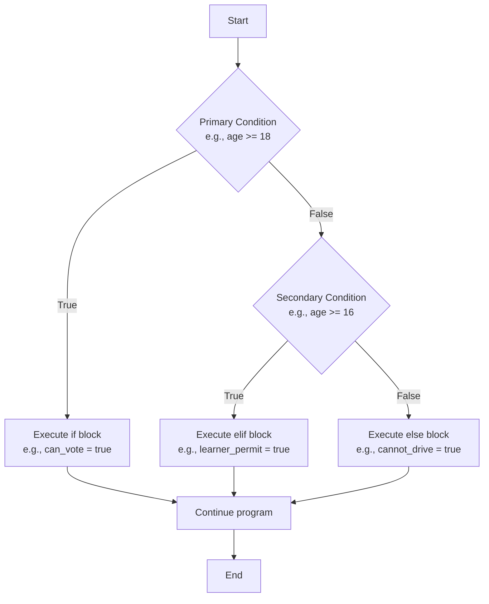
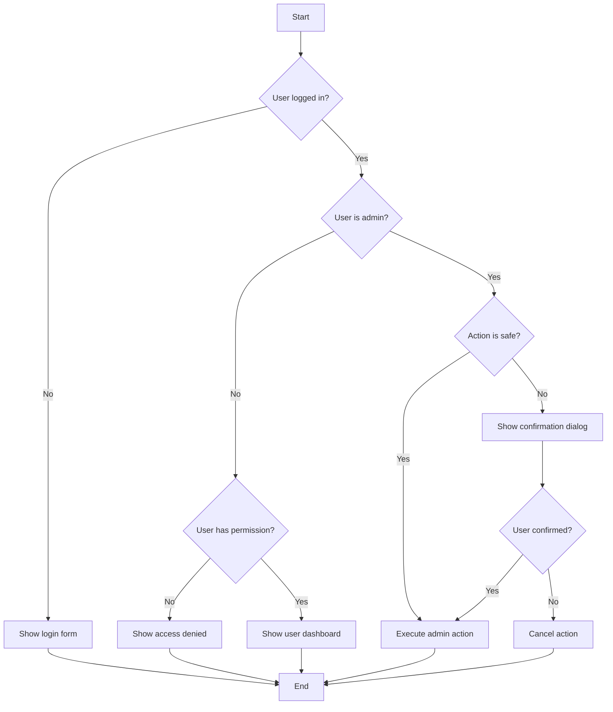
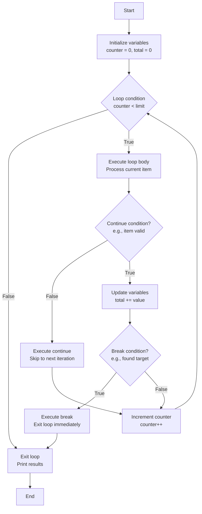
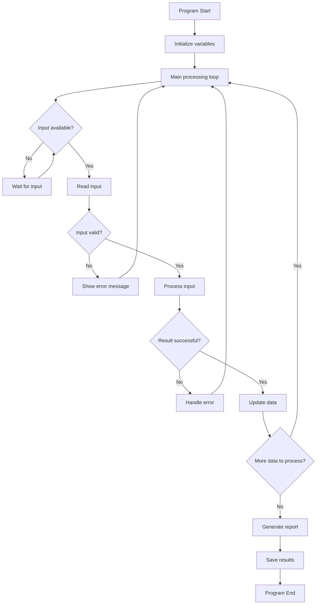

# 06. Control Structures - Program Flow Control

## Introduction

Control structures are the decision-making framework of programming. They determine the execution path of a program, enabling conditional logic, repetition, and flow control. Without control structures, programs would execute sequentially without any intelligence or adaptability. This comprehensive chapter explores all major control structures, their patterns, best practices, and real-world applications with extensive examples and visual flowcharts.

## What are Control Structures? - Deep Analysis

Control structures are fundamental programming constructs that alter the default sequential execution flow. They provide the logic and decision-making capabilities that make programs intelligent and responsive.

### Classification of Control Structures

#### 1. Conditional (Selection) Structures
Execute different code paths based on conditions
- **Simple Conditional**: if statement
- **Alternative Conditional**: if-else statement
- **Multiple Selection**: if-else if-else, switch/case
- **Nested Conditional**: conditions within conditions

#### 2. Iterative (Loop) Structures
Repeat execution of code blocks
- **Count-Controlled**: for loops (definite iteration)
- **Condition-Controlled**: while/do-while loops (indefinite iteration)
- **Collection-Based**: foreach loops
- **Recursive**: functions calling themselves

#### 3. Jump (Transfer) Structures
Alter normal execution flow
- **Break**: exit loops prematurely
- **Continue**: skip current iteration
- **Return**: exit functions
- **Goto**: jump to labeled statements (generally avoided)

#### 4. Exception Handling Structures
Manage runtime errors gracefully
- **Try-Catch**: handle exceptions
- **Throw**: raise exceptions
- **Finally**: cleanup code

### Control Structure Properties

- **Sequence**: Default top-to-bottom execution
- **Selection**: Choose between alternatives
- **Iteration**: Repeat execution
- **Recursion**: Self-referential repetition

## Conditional Statements - Decision Making Structures

Conditional statements enable programs to make decisions and execute different code paths based on evaluated conditions. They form the logical backbone of intelligent programs.

### Boolean Expressions in Conditions

Conditions are expressions that evaluate to true or false:

```python
# Numeric comparisons
x > 5
y <= 10
a == b
c != d

# Boolean variables
is_logged_in = True
if is_logged_in:
    print("Welcome!")

# Complex expressions
if (age >= 18) and (has_license == True):
    print("Can drive")

# Function calls as conditions
if user_input_validated():
    process_data()
```

### Simple If Statement

Executes code only when condition is true.

**Syntax Variations:**

**Python:**
```python
if condition:
    statement1
    statement2
    # Block continues until indentation ends
```

**JavaScript:**
```javascript
if (condition) {
    statement1;
    statement2;
}
```

**Java:**
```java
if (condition) {
    statement1;
    statement2;
}
```

**C++:**
```cpp
if (condition) {
    statement1;
    statement2;
}
```

**Advanced If Examples:**

```python
# Checking user permissions
user_role = "admin"
if user_role == "admin":
    print("Access granted to all features")
    enable_admin_panel()
    show_system_settings()

# Temperature monitoring
temperature = 75
if temperature > 80:
    print("Warning: High temperature!")
    activate_cooling_system()
    send_alert_to_maintenance()
```

### If-Else Statement - Binary Choice

Provides mutually exclusive alternatives.

**Complete Examples:**

```python
# Age verification system
def check_voting_eligibility(age):
    if age >= 18:
        print("You are eligible to vote.")
        return True
    else:
        years_to_wait = 18 - age
        print(f"You can vote in {years_to_wait} years.")
        return False

# File existence check
import os
filename = "data.txt"
if os.path.exists(filename):
    print("File found. Processing data...")
    process_file(filename)
else:
    print("File not found. Creating new file...")
    create_default_file(filename)
```

### If-Else If-Else Chain - Multiple Choices

Handles multiple mutually exclusive conditions.

**Grade Calculator Example:**

```python
def calculate_grade(score):
    if score >= 90:
        grade = "A"
        message = "Excellent work!"
    elif score >= 80:
        grade = "B"
        message = "Good job!"
    elif score >= 70:
        grade = "C"
        message = "Satisfactory"
    elif score >= 60:
        grade = "D"
        message = "Needs improvement"
    else:
        grade = "F"
        message = "Failed - must retake course"

    return grade, message

# Usage
score = 85
grade, feedback = calculate_grade(score)
print(f"Grade: {grade} - {feedback}")
```

**Traffic Light System:**

```python
def traffic_light_action(color):
    if color == "red":
        action = "Stop completely"
        duration = 30
    elif color == "yellow":
        action = "Prepare to stop"
        duration = 5
    elif color == "green":
        action = "Proceed with caution"
        duration = 45
    else:
        action = "System malfunction"
        duration = 0

    return action, duration

current_color = "yellow"
action, time_left = traffic_light_action(current_color)
print(f"Light: {current_color} - {action} ({time_left} seconds)")
```

### Nested If Statements - Hierarchical Decisions

Conditions within conditions for complex decision trees.

**Employee Bonus Calculation:**

```python
def calculate_bonus(salary, years_service, performance_rating):
    bonus = 0

    if years_service >= 5:
        if performance_rating == "excellent":
            bonus = salary * 0.15  # 15% bonus
        elif performance_rating == "good":
            bonus = salary * 0.10  # 10% bonus
        else:
            bonus = salary * 0.05  # 5% bonus
    elif years_service >= 2:
        if performance_rating in ["excellent", "good"]:
            bonus = salary * 0.05  # 5% bonus
        else:
            bonus = salary * 0.02  # 2% bonus
    else:
        bonus = salary * 0.01  # 1% minimum bonus

    return bonus

# Test cases
print(calculate_bonus(50000, 7, "excellent"))  # 7500.0
print(calculate_bonus(50000, 3, "good"))       # 2500.0
print(calculate_bonus(50000, 1, "average"))    # 500.0
```

**Medical Diagnosis System (Simplified):**

```python
def diagnose_patient(symptoms, temperature, blood_pressure):
    diagnosis = "Unknown"
    severity = "low"

    if temperature > 100.4:  # Fever
        if "cough" in symptoms and "shortness of breath" in symptoms:
            if blood_pressure < 90:
                diagnosis = "Pneumonia with hypotension"
                severity = "high"
            else:
                diagnosis = "Respiratory infection"
                severity = "medium"
        elif "headache" in symptoms and "stiff neck" in symptoms:
            diagnosis = "Meningitis"
            severity = "critical"
        else:
            diagnosis = "Viral infection"
            severity = "low"
    else:
        if blood_pressure > 140:
            diagnosis = "Hypertension"
            severity = "medium"
        elif "chest pain" in symptoms:
            diagnosis = "Possible cardiac issue"
            severity = "high"
        else:
            diagnosis = "General checkup needed"
            severity = "low"

    return diagnosis, severity

# Usage
patient_symptoms = ["cough", "fever", "fatigue"]
temp = 101.5
bp = 95
diag, sev = diagnose_patient(patient_symptoms, temp, bp)
print(f"Diagnosis: {diag} (Severity: {sev})")
```

### Switch/Case Statement - Multiway Branching

Alternative to long if-else chains for value-based selection.

**JavaScript Switch Example:**

```javascript
function get_season(month) {
    let season;

    switch (month) {
        case 12:
        case 1:
        case 2:
            season = "Winter";
            break;
        case 3:
        case 4:
        case 5:
            season = "Spring";
            break;
        case 6:
        case 7:
        case 8:
            season = "Summer";
            break;
        case 9:
        case 10:
        case 11:
            season = "Fall";
            break;
        default:
            season = "Invalid month";
    }

    return season;
}

console.log(get_season(4));  // "Spring"
console.log(get_season(11)); // "Fall"
```

**Java Switch with Strings:**

```java
public class Calculator {
    public static double calculate(double a, double b, String operation) {
        double result = 0;

        switch (operation.toLowerCase()) {
            case "add":
            case "+":
                result = a + b;
                break;
            case "subtract":
            case "-":
                result = a - b;
                break;
            case "multiply":
            case "*":
                result = a * b;
                break;
            case "divide":
            case "/":
                if (b != 0) {
                    result = a / b;
                } else {
                    throw new ArithmeticException("Division by zero");
                }
                break;
            default:
                throw new IllegalArgumentException("Unknown operation: " + operation);
        }

        return result;
    }
}
```

**Python Dictionary-Based Switch Alternative:**

```python
def get_day_name(day_number):
    days = {
        1: "Monday",
        2: "Tuesday",
        3: "Wednesday",
        4: "Thursday",
        5: "Friday",
        6: "Saturday",
        7: "Sunday"
    }

    return days.get(day_number, "Invalid day")

print(get_day_name(3))  # "Wednesday"
print(get_day_name(8))  # "Invalid day"
```

### Ternary Conditional Operator

Compact if-else for simple conditions.

```python
# Python ternary
age = 20
status = "adult" if age >= 18 else "minor"

# JavaScript ternary
let age = 20;
let status = age >= 18 ? "adult" : "minor";

# Nested ternary (use sparingly)
let category = age >= 65 ? "senior" : age >= 18 ? "adult" : "minor";
```

### Truthy/Falsy Values in Conditions

Different languages treat values as true/false differently:

```python
# Python truthy/falsy
if "hello":      # True (non-empty string)
if "":           # False (empty string)
if 5:            # True (non-zero number)
if 0:            # False (zero)
if [1, 2, 3]:    # True (non-empty list)
if []:           # False (empty list)
if None:         # False (None value)
```

```javascript
// JavaScript truthy/falsy
if ("hello")     // true
if ("")          // false
if (5)           // true
if (0)           // false
if ([1,2,3])     // true
if ([])          // true (arrays are truthy!)
if (null)        // false
if (undefined)   // false
```

### Guard Clauses - Early Returns

Simplify nested conditions by handling edge cases first:

```python
def process_user_data(user_data):
    # Guard clauses
    if not user_data:
        return "Error: No user data provided"

    if "age" not in user_data:
        return "Error: Age is required"

    if user_data["age"] < 0:
        return "Error: Invalid age"

    # Main processing
    age = user_data["age"]
    if age >= 18:
        return "Adult user processed"
    else:
        return "Minor user processed"

# Usage
print(process_user_data({}))                    # Error: No user data
print(process_user_data({"name": "John"}))      # Error: Age required
print(process_user_data({"age": -5}))           # Error: Invalid age
print(process_user_data({"age": 25}))           # Adult user processed
```

## Iterative Structures - Loops and Repetition

Loops enable programs to execute code repeatedly, processing collections of data, implementing algorithms, and automating repetitive tasks.

### For Loops - Count-Controlled Iteration

For loops are ideal when you know the number of iterations in advance.

#### Traditional C-Style For Loop

**Syntax:**
```
for (initialization; condition; increment/decrement) {
    // loop body
}
```

**JavaScript Example:**
```javascript
// Basic counting loop
for (let i = 0; i < 5; i++) {
    console.log(`Iteration ${i}`);
}

// Countdown
for (let count = 10; count > 0; count--) {
    console.log(`${count}...`);
}
console.log("Blast off!");

// Multiple variables
for (let i = 0, j = 10; i < 5; i++, j--) {
    console.log(`i: ${i}, j: ${j}`);
}
```

**Java Example:**
```java
// Enhanced for loop (foreach)
int[] numbers = {1, 2, 3, 4, 5};
for (int number : numbers) {
    System.out.println(number);
}

// Traditional for loop
for (int i = 0; i < numbers.length; i++) {
    System.out.println("Index " + i + ": " + numbers[i]);
}
```

#### Python For Loops with Range and Iterables

```python
# Basic range loop
for i in range(5):
    print(f"Iteration {i}")

# Range with start, stop, step
for i in range(2, 10, 2):  # Start at 2, stop before 10, step by 2
    print(i)  # 2, 4, 6, 8

# Iterating over collections
fruits = ["apple", "banana", "cherry"]
for fruit in fruits:
    print(f"I like {fruit}")

# Enumerating with index
for index, fruit in enumerate(fruits):
    print(f"{index}: {fruit}")

# Iterating over strings
for char in "Python":
    print(char)

# Dictionary iteration
person = {"name": "Alice", "age": 25, "city": "New York"}
for key, value in person.items():
    print(f"{key}: {value}")
```

#### Advanced For Loop Patterns

**Nested Loops for Multi-dimensional Data:**

```python
# Multiplication table
for i in range(1, 6):
    for j in range(1, 6):
        print(f"{i*j:2}", end=" ")
    print()  # New line

# Matrix operations
matrix = [
    [1, 2, 3],
    [4, 5, 6],
    [7, 8, 9]
]

# Print matrix
for row in matrix:
    for element in row:
        print(element, end=" ")
    print()

# Sum of each row
for i, row in enumerate(matrix):
    row_sum = sum(row)
    print(f"Row {i+1} sum: {row_sum}")
```

**List Comprehensions (Python):**

```python
# Traditional approach
squares = []
for i in range(10):
    squares.append(i ** 2)

# List comprehension
squares = [i ** 2 for i in range(10)]

# With conditions
even_squares = [i ** 2 for i in range(10) if i % 2 == 0]

# Nested comprehensions
matrix = [[i * j for j in range(5)] for i in range(5)]
```

### While Loops - Condition-Controlled Iteration

While loops continue execution as long as a condition remains true.

#### Basic While Loop Structure

```python
# Basic syntax
while condition:
    # loop body
    # update condition variable

# Example: Counting to 5
count = 1
while count <= 5:
    print(f"Count: {count}")
    count += 1
```

#### Sentinel-Controlled Loops

```python
# Continue until user enters specific value
total = 0
while True:
    user_input = input("Enter a number (0 to stop): ")
    number = float(user_input)

    if number == 0:
        break

    total += number
    print(f"Running total: {total}")

print(f"Final total: {total}")
```

#### Input Validation with While Loops

```python
def get_valid_age():
    while True:
        try:
            age = int(input("Enter your age (0-120): "))
            if 0 <= age <= 120:
                return age
            else:
                print("Age must be between 0 and 120.")
        except ValueError:
            print("Please enter a valid number.")

age = get_valid_age()
print(f"Your age is: {age}")
```

#### Game Loop Example

```python
import random

def number_guessing_game():
    target = random.randint(1, 100)
    attempts = 0

    print("I'm thinking of a number between 1 and 100.")

    while True:
        try:
            guess = int(input("Your guess: "))
            attempts += 1

            if guess < target:
                print("Too low!")
            elif guess > target:
                print("Too high!")
            else:
                print(f"Correct! You found it in {attempts} attempts.")
                break

        except ValueError:
            print("Please enter a valid number.")

number_guessing_game()
```

### Do-While Loops - Post-Test Iteration

Do-while loops execute the body at least once before checking the condition.

**JavaScript/C++/Java Example:**
```javascript
// JavaScript do-while
let userInput;
do {
    userInput = prompt("Enter 'quit' to exit: ");
    console.log("You entered: " + userInput);
} while (userInput !== "quit");

// Menu system
let choice;
do {
    console.log("\nMenu:");
    console.log("1. Play game");
    console.log("2. View scores");
    console.log("3. Quit");

    choice = prompt("Enter your choice: ");

    switch (choice) {
        case "1":
            console.log("Starting game...");
            break;
        case "2":
            console.log("High scores: ...");
            break;
        case "3":
            console.log("Goodbye!");
            break;
        default:
            console.log("Invalid choice.");
    }
} while (choice !== "3");
```

**Python Equivalent (using while True with break):**
```python
# Simulate do-while with while True
user_input = ""
while True:
    user_input = input("Enter 'quit' to exit: ")
    print(f"You entered: {user_input}")
    if user_input == "quit":
        break
```

### Foreach Loops - Collection Iteration

Modern languages provide foreach loops for iterating over collections.

```python
# Python foreach-style
fruits = ["apple", "banana", "cherry"]
for fruit in fruits:
    print(fruit)

# With index
for index, fruit in enumerate(fruits):
    print(f"{index}: {fruit}")
```

```java
// Java enhanced for loop
List<String> fruits = Arrays.asList("apple", "banana", "cherry");
for (String fruit : fruits) {
    System.out.println(fruit);
}

// With index (traditional for loop)
for (int i = 0; i < fruits.size(); i++) {
    System.out.println(i + ": " + fruits.get(i));
}
```

```javascript
// JavaScript for-of loop
const fruits = ["apple", "banana", "cherry"];
for (const fruit of fruits) {
    console.log(fruit);
}

// With index
for (const [index, fruit] of fruits.entries()) {
    console.log(`${index}: ${fruit}`);
}
```

### Loop Control Statements - Altering Loop Execution

#### Break Statement - Premature Exit

```python
# Find first even number
numbers = [1, 3, 5, 6, 8, 9]
for num in numbers:
    if num % 2 == 0:
        print(f"First even number: {num}")
        break

# Exit nested loops
for i in range(3):
    for j in range(3):
        if i == 1 and j == 1:
            print("Breaking out of nested loops")
            break
    else:
        continue
    break  # This break exits the outer loop
```

#### Continue Statement - Skip Iteration

```python
# Skip odd numbers
for i in range(10):
    if i % 2 != 0:  # If odd
        continue
    print(f"Even number: {i}")

# Process only valid data
data = [10, "invalid", 20, None, 30, "bad"]
for item in data:
    if item is None or isinstance(item, str):
        continue
    print(f"Processing: {item}")
```

#### Else Clauses in Loops

```python
# For loop with else
for i in range(5):
    if i == 10:  # This never happens
        print("Found 10")
        break
else:
    print("Loop completed without finding 10")

# While loop with else
count = 0
while count < 5:
    print(count)
    count += 1
    if count == 10:  # Never true
        break
else:
    print("While loop completed normally")
```

### Advanced Loop Patterns and Techniques

#### Loop with Early Exit and Cleanup

```python
def process_files(file_list):
    processed_count = 0

    for filename in file_list:
        try:
            # Attempt to process file
            if not validate_file(filename):
                print(f"Skipping invalid file: {filename}")
                continue

            process_file(filename)
            processed_count += 1

            # Check for maximum processing limit
            if processed_count >= 100:
                print("Reached processing limit")
                break

        except Exception as e:
            print(f"Error processing {filename}: {e}")
            # Decide whether to continue or break
            if "critical" in str(e):
                print("Critical error - stopping processing")
                break

    print(f"Successfully processed {processed_count} files")
```

#### Loop with Progress Tracking

```python
import time

def process_with_progress(items, description="Processing"):
    total = len(items)
    processed = 0

    for item in items:
        # Process item
        process_item(item)
        processed += 1

        # Show progress
        progress = (processed / total) * 100
        print(f"\r{description}: {progress:.1f}% complete", end="")

        # Simulate processing time
        time.sleep(0.1)

    print("\nProcessing complete!")

# Usage
items = list(range(100))
process_with_progress(items, "Data processing")
```

#### Infinite Loops with Controlled Exit

```python
def interactive_calculator():
    print("Simple Calculator")
    print("Enter 'quit' to exit")

    while True:
        try:
            expression = input("Enter expression (e.g., 2 + 3): ")

            if expression.lower() in ['quit', 'exit', 'q']:
                print("Goodbye!")
                break

            # Simple expression evaluation (in real code, use safer methods)
            result = eval(expression)
            print(f"Result: {result}")

        except Exception as e:
            print(f"Error: {e}. Please try again.")

interactive_calculator()
```

### Nested Loops - Multi-Level Iteration

#### Matrix Operations

```python
def create_matrix(rows, cols):
    return [[i * cols + j for j in range(cols)] for i in range(rows)]

def print_matrix(matrix):
    for row in matrix:
        print(" ".join(f"{num:3}" for num in row))

def matrix_addition(matrix1, matrix2):
    if len(matrix1) != len(matrix2) or len(matrix1[0]) != len(matrix2[0]):
        raise ValueError("Matrices must have same dimensions")

    result = []
    for i in range(len(matrix1)):
        row = []
        for j in range(len(matrix1[0])):
            row.append(matrix1[i][j] + matrix2[i][j])
        result.append(row)

    return result

# Usage
m1 = create_matrix(3, 3)
m2 = create_matrix(3, 3)
print("Matrix 1:")
print_matrix(m1)
print("\nMatrix 2:")
print_matrix(m2)

sum_matrix = matrix_addition(m1, m2)
print("\nSum:")
print_matrix(sum_matrix)
```

#### Pattern Generation

```python
def print_patterns():
    # Right triangle
    print("Right Triangle:")
    for i in range(5):
        for j in range(i + 1):
            print("*", end="")
        print()

    print("\nInverted Triangle:")
    # Inverted triangle
    for i in range(5, 0, -1):
        for j in range(i):
            print("*", end="")
        print()

    print("\nPyramid:")
    # Pyramid
    for i in range(5):
        # Print spaces
        for j in range(5 - i - 1):
            print(" ", end="")
        # Print stars
        for j in range(2 * i + 1):
            print("*", end="")
        print()

print_patterns()
```

### Loop Optimization Techniques

#### Avoid Unnecessary Work

```python
# Inefficient: checking condition inside loop
total = 0
for i in range(1000000):
    if some_expensive_condition(i):  # Called 1M times
        total += i

# Better: pre-compute or use different logic
# Option 1: Check condition outside if possible
# Option 2: Use list comprehension with filter
total = sum(i for i in range(1000000) if some_expensive_condition(i))
```

#### Use Appropriate Loop Type

```python
# For known iterations: use for loop
for i in range(10):
    process_item(i)

# For unknown iterations: use while loop
while not file_end_reached():
    process_next_line()

# For collection iteration: use foreach
for item in collection:
    process(item)
```

#### Minimize Work Inside Loops

```python
# Inefficient
for i in range(1000):
    result = expensive_function()  # Called 1000 times
    process(result + i)

# Better
expensive_result = expensive_function()  # Called once
for i in range(1000):
    process(expensive_result + i)
```

## Comprehensive Flowchart Diagrams

Flowcharts visually represent the logic flow in control structures, making complex decision-making processes easier to understand and debug.

### Complete Conditional Flowchart



### Nested Conditions Flowchart



### Complete Loop Flowchart



### Complex Program Flowchart



## Advanced Control Structure Patterns

### State Machine Pattern

```python
class TrafficLight:
    def __init__(self):
        self.state = "red"
        self.timer = 0

    def update(self):
        self.timer += 1

        if self.state == "red":
            if self.timer >= 30:
                self.state = "green"
                self.timer = 0
        elif self.state == "green":
            if self.timer >= 45:
                self.state = "yellow"
                self.timer = 0
        elif self.state == "yellow":
            if self.timer >= 5:
                self.state = "red"
                self.timer = 0

    def get_action(self):
        actions = {
            "red": "Stop",
            "yellow": "Prepare to stop",
            "green": "Go"
        }
        return actions.get(self.state, "Unknown")

# Usage
light = TrafficLight()
for _ in range(100):
    light.update()
    print(f"Light: {light.state} - Action: {light.get_action()}")
```

### Event-Driven Programming Pattern

```javascript
class EventEmitter {
    constructor() {
        this.events = {};
    }

    on(event, callback) {
        if (!this.events[event]) {
            this.events[event] = [];
        }
        this.events[event].push(callback);
    }

    emit(event, data) {
        if (this.events[event]) {
            this.events[event].forEach(callback => callback(data));
        }
    }
}

// Usage
const button = new EventEmitter();

button.on('click', (data) => {
    console.log('Button clicked!', data);
});

button.on('click', (data) => {
    console.log('Processing click event');
});

// Simulate button clicks
button.emit('click', {x: 100, y: 200});
button.emit('click', {x: 150, y: 250});
```

### Iterator Pattern with Generators

```python
def fibonacci_generator(limit):
    """Generate Fibonacci numbers up to a limit"""
    a, b = 0, 1
    count = 0

    while count < limit:
        yield a
        a, b = b, a + b
        count += 1

# Usage
for fib_num in fibonacci_generator(10):
    print(fib_num, end=" ")
print()  # 0 1 1 2 3 5 8 13 21 34
```

### Exception Handling Patterns

```python
class CustomError(Exception):
    pass

def safe_division(a, b):
    """Safe division with comprehensive error handling"""
    try:
        if not isinstance(a, (int, float)) or not isinstance(b, (int, float)):
            raise TypeError("Both arguments must be numbers")

        if b == 0:
            raise ZeroDivisionError("Division by zero is not allowed")

        result = a / b

        if result == float('inf') or result == float('-inf'):
            raise OverflowError("Result is infinity")

        return result

    except TypeError as e:
        print(f"Type error: {e}")
        return None
    except ZeroDivisionError as e:
        print(f"Division error: {e}")
        return None
    except OverflowError as e:
        print(f"Overflow error: {e}")
        return None
    except Exception as e:
        print(f"Unexpected error: {e}")
        return None
    finally:
        print("Division operation completed")

# Usage
print(safe_division(10, 2))    # 5.0
print(safe_division(10, 0))    # None (with error message)
print(safe_division("10", 2))  # None (with error message)
```

## Performance Considerations

### Loop Optimization

```python
import time

# Inefficient: repeated calculations
start = time.time()
total = 0
for i in range(100000):
    total += i ** 2  # Power calculated each iteration
end = time.time()
print(f"Inefficient: {end - start:.4f} seconds")

# Efficient: pre-calculate or use better algorithm
start = time.time()
total = sum(i ** 2 for i in range(100000))  # More efficient
end = time.time()
print(f"Efficient: {end - start:.4f} seconds")

# Mathematical formula (most efficient)
start = time.time()
n = 100000
total = n * (n - 1) * (2 * n - 1) // 6  # Closed-form formula
end = time.time()
print(f"Mathematical: {end - start:.4f} seconds")
```

### Conditional Optimization

```python
# Inefficient: complex condition evaluated every time
def check_access(user, resource):
    return (user.is_logged_in and
            user.has_permission(resource) and
            not user.is_suspended and
            resource.is_active)

# Better: early returns for common cases
def check_access_optimized(user, resource):
    if not user.is_logged_in:
        return False

    if user.is_suspended:
        return False

    if not resource.is_active:
        return False

    return user.has_permission(resource)
```

## Common Anti-Patterns and How to Avoid Them

### 1. Arrowhead Anti-Pattern (Excessive Nesting)

**Bad:**
```python
def process_data(data):
    if data is not None:
        if data.is_valid():
            if data.has_content():
                if data.size() > 0:
                    # Finally do something
                    process_content(data)
```

**Good:**
```python
def process_data(data):
    if (data is None or
        not data.is_valid() or
        not data.has_content() or
        data.size() <= 0):
        return

    process_content(data)
```

### 2. Loop and a Half Anti-Pattern

**Bad:**
```python
while True:
    user_input = get_input()
    if user_input == "quit":
        break
    process_input(user_input)
```

**Good:**
```python
user_input = get_input()
while user_input != "quit":
    process_input(user_input)
    user_input = get_input()
```

### 3. Duplicate Condition Checks

**Bad:**
```python
if user.age >= 18:
    if user.has_id:
        if user.is_citizen:
            allow_voting()
```

**Good:**
```python
if user.age >= 18 and user.has_id and user.is_citizen:
    allow_voting()
```

## Real-World Applications

### 1. Game Development - Main Game Loop

```python
class Game:
    def __init__(self):
        self.running = True
        self.score = 0
        self.level = 1

    def handle_input(self):
        # Process keyboard/mouse input
        pass

    def update_game_state(self):
        # Update positions, check collisions, etc.
        pass

    def render(self):
        # Draw graphics
        pass

    def run(self):
        while self.running:
            self.handle_input()

            if self.check_game_over():
                self.running = False
                break

            self.update_game_state()
            self.render()

            # Control frame rate
            time.sleep(1/60)  # 60 FPS

        self.show_final_score()

    def check_game_over(self):
        return self.score < 0 or self.level > 10
```

### 2. Web Server Request Processing

```python
def handle_http_request(request):
    # Authentication check
    if not request.has_valid_token():
        return send_unauthorized_response()

    # Route to appropriate handler
    if request.method == "GET":
        if request.path == "/users":
            return handle_get_users(request)
        elif request.path.startswith("/users/"):
            user_id = extract_user_id(request.path)
            return handle_get_user(user_id, request)
        else:
            return send_not_found_response()

    elif request.method == "POST":
        if request.path == "/users":
            return handle_create_user(request)
        else:
            return send_method_not_allowed_response()

    else:
        return send_method_not_allowed_response()
```

### 3. Data Processing Pipeline

```python
def process_sensor_data(sensor_readings):
    processed_data = []

    for reading in sensor_readings:
        # Validate reading
        if not is_valid_reading(reading):
            continue

        # Apply calibration
        calibrated = apply_calibration(reading)

        # Filter outliers
        if is_outlier(calibrated):
            continue

        # Apply smoothing
        smoothed = apply_smoothing(calibrated, processed_data)

        # Store processed data
        processed_data.append(smoothed)

        # Check for alerts
        if should_trigger_alert(smoothed):
            trigger_alert(smoothed)

    return processed_data
```

## Testing Control Structures

### Unit Testing Conditional Logic

```python
import unittest

class TestGradeCalculator(unittest.TestCase):
    def test_calculate_grade_a(self):
        self.assertEqual(calculate_grade(95), 'A')

    def test_calculate_grade_b(self):
        self.assertEqual(calculate_grade(85), 'B')

    def test_calculate_grade_f(self):
        self.assertEqual(calculate_grade(45), 'F')

    def test_boundary_conditions(self):
        self.assertEqual(calculate_grade(90), 'A')  # Boundary
        self.assertEqual(calculate_grade(89), 'B')  # Just below boundary

def calculate_grade(score):
    if score >= 90:
        return 'A'
    elif score >= 80:
        return 'B'
    elif score >= 70:
        return 'C'
    elif score >= 60:
        return 'D'
    else:
        return 'F'
```

### Testing Loop Behavior

```python
class TestLoops(unittest.TestCase):
    def test_finite_loop(self):
        result = []
        for i in range(3):
            result.append(i * 2)
        self.assertEqual(result, [0, 2, 4])

    def test_while_loop_with_break(self):
        result = []
        i = 0
        while i < 10:
            if i == 5:
                break
            result.append(i)
            i += 1
        self.assertEqual(result, [0, 1, 2, 3, 4])

    def test_continue_statement(self):
        result = []
        for i in range(5):
            if i == 2:
                continue
            result.append(i)
        self.assertEqual(result, [0, 1, 3, 4])
```

## Summary

Control structures are the backbone of program logic, enabling conditional execution, repetition, and flow control. From simple if statements to complex nested loops, these constructs allow programs to make decisions and adapt their behavior based on data and conditions.

Mastering control structures requires understanding:
- **Conditional logic**: Making decisions with if-else chains
- **Loop patterns**: Choosing appropriate iteration methods
- **Control flow**: Using break, continue, and return effectively
- **Best practices**: Avoiding common pitfalls and anti-patterns
- **Performance**: Optimizing for efficiency
- **Testing**: Verifying correct behavior under various conditions

Practice with diverse scenarios, from simple calculators to complex game loops, to build proficiency in using control structures effectively.

## Comprehensive Exercises

### Basic Control Structure Mastery

1. **Multi-Condition Logic**: Write a program that determines eligibility for a loan based on age, income, and credit score using nested conditions.

2. **Loop Pattern Selection**: Implement three different ways to sum numbers from 1 to 100 (for loop, while loop, mathematical formula) and compare their performance.

3. **Input Validation System**: Create a robust input validation system that handles multiple data types and provides specific error messages.

### Intermediate Challenges

4. **Menu-Driven Program**: Build a console-based menu system for a library management application with options to add, remove, search, and display books.

5. **Number Analysis**: Write a program that analyzes a list of numbers and provides statistics (mean, median, mode, range) using appropriate loop structures.

6. **Text Processing**: Create a text analyzer that counts words, sentences, and paragraphs, and finds the most frequent words using control structures.

### Advanced Applications

7. **Simple Interpreter**: Implement a basic calculator that can parse and evaluate mathematical expressions with operator precedence.

8. **Game State Management**: Design a turn-based game (like tic-tac-toe) with proper state management, input validation, and win condition checking.

9. **Data Processing Pipeline**: Build a data processing system that reads data from a file, validates it, transforms it, and writes results using appropriate control structures.

### Algorithm Implementation

10. **Sorting Algorithm**: Implement bubble sort and selection sort, comparing their efficiency with different data sets.

11. **Search Algorithm**: Implement linear search and binary search, demonstrating their use cases and performance differences.

12. **Pattern Generation**: Create programs that generate various patterns (stars, numbers, characters) using nested loops.

### Real-World Simulation

13. **Banking System**: Simulate a simple banking system with account creation, deposits, withdrawals, and balance checks.

14. **Inventory Management**: Build an inventory system for a store with stock tracking, low stock alerts, and sales processing.

15. **Student Grade Management**: Create a system to manage student grades, calculate GPAs, and generate reports.

## Further Reading and Resources

### Books
- **"Clean Code"** by Robert C. Martin - Code quality and structure
- **"Code Complete"** by Steve McConnell - Professional programming practices
- **"Programming Pearls"** by Jon Bentley - Algorithmic thinking
- **"The Pragmatic Programmer"** by Andrew Hunt and David Thomas

### Online Resources
- **GeeksforGeeks**: Comprehensive algorithm and data structure tutorials
- **LeetCode**: Practice coding problems with control structures
- **HackerRank**: Algorithm challenges and tutorials
- **freeCodeCamp**: Interactive programming lessons

### Academic References
- **"Structured Programming"** by Edsger Dijkstra
- **"Go To Statement Considered Harmful"** by Edsger Dijkstra
- **"Flowcharts"** - Original research on program visualization

### Tools for Practice
- **Visual Studio Code**: With debugging extensions
- **PyCharm**: Python IDE with control flow visualization
- **Eclipse**: Java development with flow analysis
- **Online IDEs**: Repl.it, CodePen for quick experimentation

Remember: Control structures are the building blocks of logic in programming. Mastering them enables you to create programs that can make decisions, repeat actions, and adapt to different situations. Practice regularly with increasingly complex scenarios to develop strong problem-solving skills.